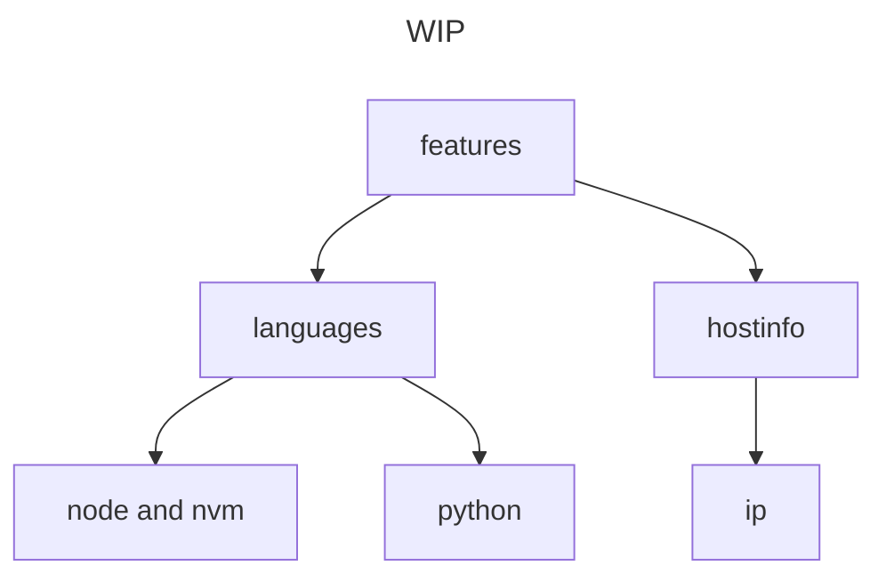

# Developer Theme


This is a oh my bash theme forked from bobby theme to provide a more useful promp to a software engineer.

## Project Mantra

- KISS (Keep It Simple Stupid).
- Performance is not important, readability and utility is it.
    - is for developer so im assuming you are using a good processor (someting like 4 cores 1.5 Ghz)


## install

### requirements

1. oh my bash previously installed [OMB site](https://ohmybash.nntoan.com) 

### install steps
```shell
git clone https://github.com/marco-gallegos/developer.github
cd developer

# needs gnu make -> sudo apt install make
make install 

nvim ~/.bashrc 

## edit OSH_THEME set to ->
## OSH_THEME="developer"

```

## features

- [x] show hostname
- [x] show ip
- [x] show node version (and if is using nvm)
- [x] show python version
- [x] show go version
- [x] show cpu temp (with thermal tiers with colors (blue,default,yellow,red,red with exclamation))
- [x] same colors everywhere
- [x] bobby theme structure and features (git status, 2 lines, responsive)
- [x] platform selection using a env VAR ($PROMPT_THEME_PLATFORM)


